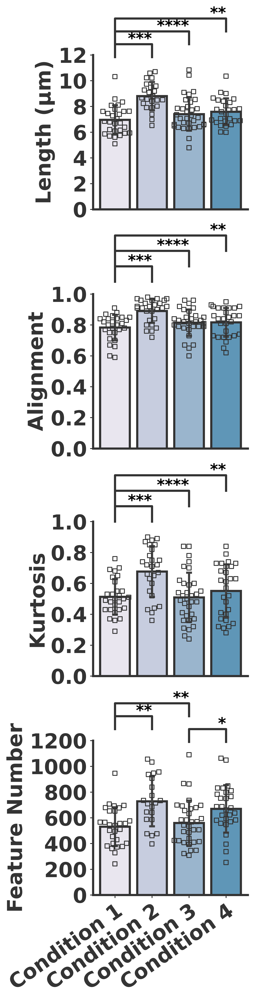
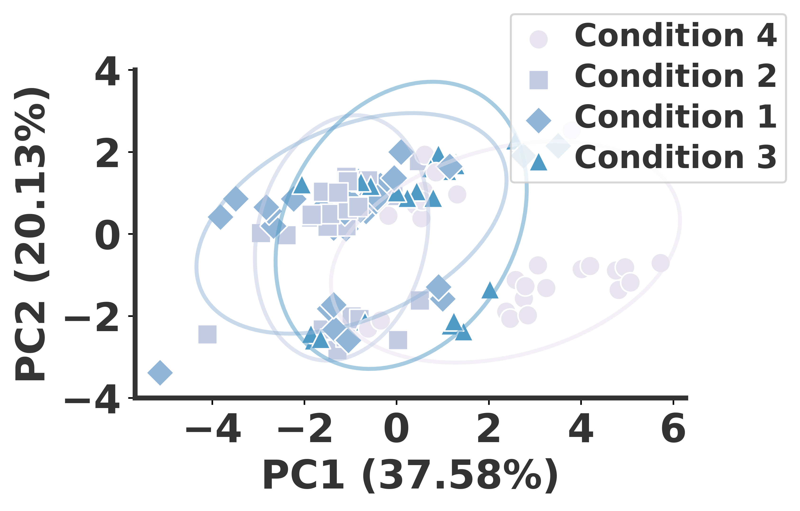

# Collagen-Fiber-Analysis
A fully automated Python pipeline for quantifying collagen fiber morphology across ten different metrics and four experimental conditions. Includes data preprocessing, outlier removal, statistical testing (ANOVA, PCA), and generation of publication-ready visualizations.

## 📊 Results Overview

### Collagen Feature Panel

---

### PCA Visualization

