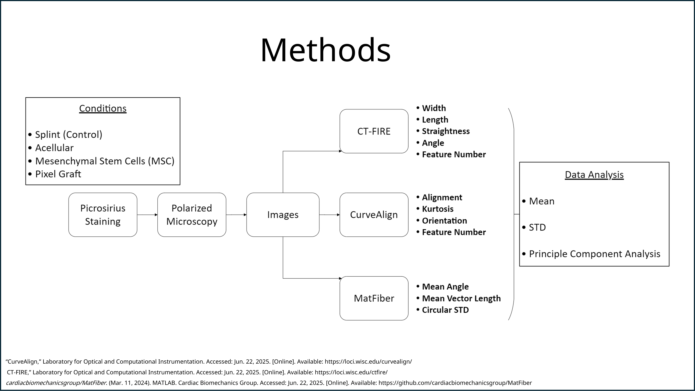

# Collagen-Fiber-Analysis
A fully automated Python pipeline for quantitative analysis of collagen fiber images captured with polarized light microscopy. The workflow includes preprocessing, outlier removal, statistical testing (ANOVA, PCA), and the generation of publication-ready visualizations.

  

  

